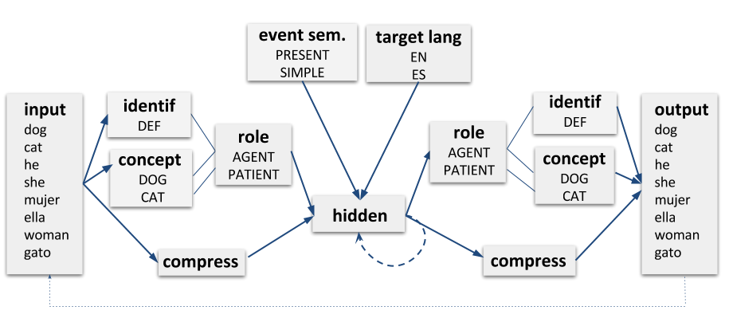

# Bilingual Dual path model



Dual path is a computational model of (monolingual) sentence production by Chang, 2002

Take a look at this tutorial: https://sites.google.com/site/sentenceproductionmodel/Home/tutorial


From Chang F., 2002:
```
Learning algorithm: back-propagation, using a modified momentum algorithm (doug momentum)
Doug momentum: similar to standard momentum descent with the exception that the pre-momentum
weight step vector is bounded so that its length cannot exceed 1.0 (Rohde, 1999).

The cwhere and word units used the soft-max activation function.
Soft-max units caused the output to be passed through an exponential function, which magnified
small differences, and the result was then normalized (leaving only the most activated unit, and
squashing the activation of all the weaker competitors). Because soft-max units were used for 
the word output units, the error function for these units was the divergence function 
(sum over all units: target × log(target/output)). 
All other units used the logistic activation function.
```

To run the model: 


```
python dual_path.py -h 
```

to see all the parameters of the model.

```
usage: dual_path.py [-h] [-hidden HIDDEN] [-epochs EPOCHS] [-input INPUT]
                    [-resdir RESDIR] [-lang LANG] [-lrate LRATE] [-pron PRON]
                    [-set_weights SET_WEIGHTS]
                    [-set_weights_epoch SET_WEIGHTS_EPOCH] [-fw FW]
                    [-compress COMPRESS] [-lexicon LEXICON]
                    [-concepts CONCEPTS] [-role ROLE] [-eventsem EVENTSEM]
                    [-trainset TRAINSET] [-testset TESTSET]
                    [-generate_num GENERATE_NUM] [-test_every TEST_EVERY]
                    [-title TITLE] [-sim SIM] [-prodrop] [-norolecopy]
                    [-debug] [-nodlr] [-nolang] [-gender] [-emph]

optional arguments:
    -h, --help            show this help message and exit
    -hidden HIDDEN        number of hidden layer units. (default: 30)
    -epochs EPOCHS        Number that indicates the number of train set iterations by the model during training. (default: 20)
    -input INPUT          (Input) folder that contains the input files (lexicon, concepts etc) (default: None)
    -resdir RESDIR, -r RESDIR Prefix of results folder name; will be stored under folder "simulations"and a timestamp will be added (default: None)
    -lang LANG            In case we want to generate a new set, we need to specify the language (en, es or any other string for bilingual) (default: en)
    -lrate LRATE          Learning rate. (default: 0.1)
    -pron PRON            Defines percentage of pronouns (vs NPs) on subject level. If not set, there will be no pronouns in the test/train set (default: 100)
    -set_weights SET_WEIGHTS, -sw SET_WEIGHTS We can set a folder that contains pre-trained weights as initial weights for simulations (default: None)
    -set_weights_epoch SET_WEIGHTS_EPOCH, -swe SET_WEIGHTS_EPOCH In case of pre-trained weights we can also specify num of epochs under the -sw folder (default: None)
    -fw FW, -fixed_weights FW Fixed weight value for concept-role connections (default: 18)
    -compress COMPRESS    Number of compress layer units (default: None)
    -lexicon LEXICON      File name that contains the lexicon (default: lexicon.in)
    -concepts CONCEPTS    File name that contains the concepts (default: concepts.in)
    -role ROLE            File name that contains the roles (default: roles.in)
    -eventsem EVENTSEM    File name that contains the event semantics (default: event_sem.in)
    -trainset TRAINSET, -train TRAINSET File name that contains the message-sentence pair for training. If left empty, the train*.* file under input will be used. (default: None)
    -testset TESTSET, -test TESTSET Test set file name (optional) (default: None)
    -generate_num GENERATE_NUM Generate new train/test dataset. generate_num is the sum of sentences that will be generated (default: 2500)
    -test_every TEST_EVERY Test network every x epochs (default: 1)
    -title TITLE          Title for the plot(s) (default: None)
    -sim SIM              Train several simulations (sim) at once to take the average of the results (Monte Carlo approach)(default: 2)
    -prodrop              Indicates that it is a pro-drop lang (default: False)
    -norolecopy           If set, the produced role layer is not copied back to the comprehension layer (default: False)
    -debug                Debugging info for SRN layers and deltas (default: False)
    -nodlr                Stop automatic decrease of lrate (default: True)
    -nolang               Exclude language info during TESTing (default: False)
    -gender               Include semantic gender for nouns (default: False)
    -emph                 Include emphasis concept 30% of the time (default: False)
```


The output is stored under the given results folder (-resdir) in the following format:

```
OUT:she present -s the brother the bag .
TRG:she present -s the brother the bag .
CS:False POS:True (correct sentence)
AGENT=GIRL,PRON;ACTION=PRESENT;RECIPIENT=DEF,BROTHER;PATIENT=DEF,BAG;E=EN,SIMPLE,PAT,PRESENT
----------------
```

Where OUT: is the produced sentence, TRG: the target (intended) sentence, CS: whether the sentence is code-switched (always False in the monolingual case), POS: Whether the Part of Speech (syntactic structure) was correct, (correct sentence) if the TRG sentence was identical to OUT and (incorrect sentence) otherwise.
The last sentence is the message used to produce the sentence.
    
